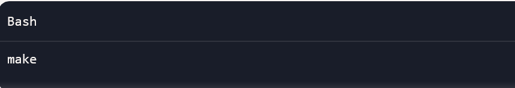
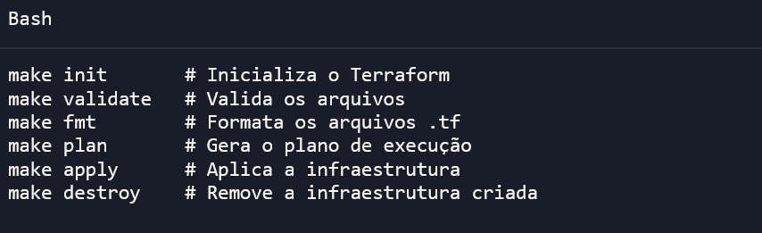

⚙️ Automação com Makefile
Este projeto utiliza um Makefile para simplificar o uso do Terraform.
Com ele, você não precisa lembrar todos os comandos longos do Terraform — basta rodar make e o processo completo de deploy acontece automaticamente.

🎯 Alvo padrão
O alvo padrão é aws-deploy. Isso significa que, ao rodar:
make

O Makefile executa a sequência completa:
- terraform init → inicializa o projeto
- terraform validate → valida a configuração
- terraform fmt → formata os arquivos
- terraform plan → gera o plano de execução
- terraform apply → aplica a infraestrutura na AWS

📦 Outros comandos disponíveis
Você também pode rodar cada etapa separadamente:

